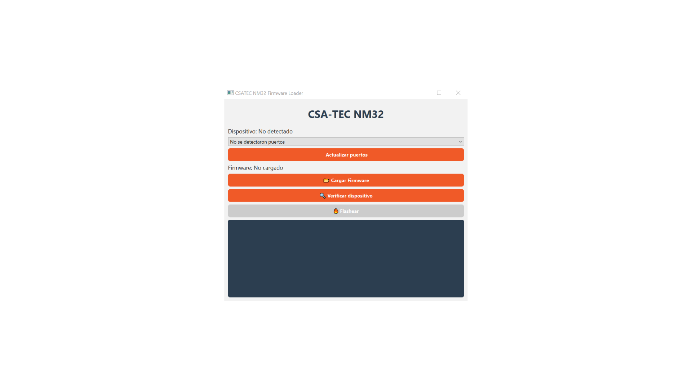

<h1 align="center">NM Uploader</h1>

  Herramienta para carga de firmware y gestión de dispositivos NM32

  

---

## 📌 Descripción

NM Uploader es una aplicación diseñada para facilitar la carga de firmware en dispositivos ESP32 de manera rápida y sencilla.

---

## 🖥️ Interfaz

### 🔌 Selección de puerto

  

### 📋 Menú principal

---

## ⚙️ Características

- Selección automática de puertos
- Interfaz simple e intuitiva
- Compatible con múltiples dispositivos
- Proceso de carga optimizado

---

## 📦 Instalación

1. Descargar la última versión desde `releases`
2. Ejecutar el instalador
3. Conectar el dispositivo
4. Seleccionar el puerto y cargar

---

## 🛠️ Tecnologías utilizadas

- Python / C++ (según tu caso)
- ESP32
- Serial Communication

---

## 📷 Vista rápida

  
  

---

## 📄 Licencia

Este proyecto está bajo licencia MIT.
